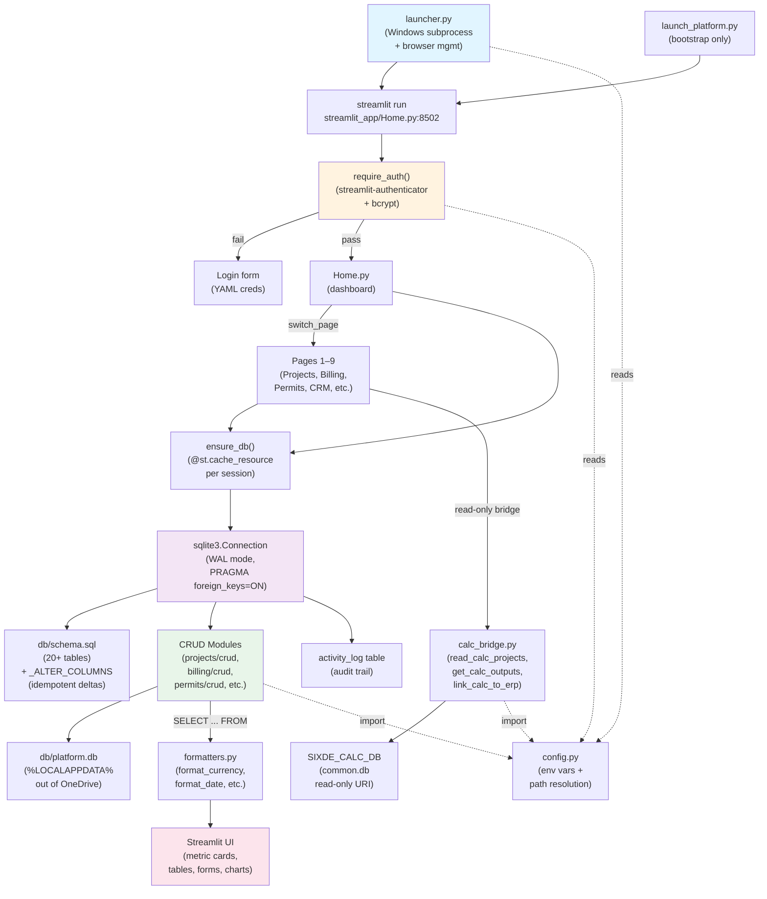

# Appendix B — Current Platform Cartography (v3.2)

**Date:** 2026-05-20
**Method:** Read/Glob/Grep over `streamlit_app/`, `modules/`, `db/`, `scripts/`, `tests/`, plus key root files (`launcher.py`, `launch_platform.py`, `config.py`, `auth_config.yaml`, session notes, `CHANGELOG.md`).
**Version note:** Cartography found v3.2 artifacts; memory previously recorded v3.1. Memory has been (or should be) updated.

---

## 1. Entry Points & Launcher

The platform has **three independent entry mechanisms**, all launching `streamlit_app/Home.py` at port 8502:

### launcher.py (Primary — production-ready)
- **Purpose:** Starts Streamlit in background, polls port 8502, opens browser, manages lifecycle cleanly on exit.
- **Key design:** Works in three modes: (a) direct `python launcher.py`, (b) `.bat` shortcut via `pythonw launcher.py`, (c) PyInstaller-built `.exe`.
- **Path resolution:** Works frozen or source via `Path.home()` and `Path(__file__)` logic.
- **Startup:** 45-second cold-start budget; polls every 0.4s. On port already bound, opens browser and exits immediately (avoids duplicate servers).
- **Subprocess:** Creates hidden console window on Windows (`CREATE_NO_WINDOW`), stdout/stderr redirected to `/dev/null`. Logs to `launcher.log` only.
- **Logging:** File-based only (stdlib logging to `launcher.log` alongside the launcher). No stdout dependency (critical for `--noconsole` PyInstaller builds).

### launch_platform.py (Bootstrap alternative)
- **Purpose:** Minimal bootstrap that displays config and runs Streamlit directly without subprocess wrapping.
- **Pre-flight checks:** Verifies `auth_config.yaml` exists; exits with clear error if missing, including bcrypt hashing snippet.
- **Output:** Prints runtime config (DB backend, DB path, legacy path, auth path) to console for operator verification (A1 — confirms migration off OneDrive worked).

### Launch_6DE_Platform.bat
- Windows shortcut that runs `pythonw launcher.py` (hidden console).

---

## 2. Page / Module Inventory

**10 pages confirmed.** All live under `streamlit_app/`:
- **Home.py** — Main dashboard (non-numbered). Entry point; gate behind `require_auth()`.
- **pages/1_Projects.py** — Project management: list, create, edit, search, milestones, calculator integration.
- **pages/2_Billing.py** — Invoicing & proposals: invoice management, proposal tracking, AR aging.
- **pages/3_Permits.py** — Permit tracking: list, create, status workflow, inspector contacts, CCA deadlines.
- **pages/4_CRM.py** — Opportunities (currently bridged from proposals via B5 fix in S35): pipeline, stages, forecasting.
- **pages/5_Timekeeping.py** — Time entry, labor cost rollup, unbilled-time tracking.
- **pages/6_Financials.py** — Financial summaries: AR aging, profitability, utilization, forecast. (B2 — `Styler.rename` fixed S35.)
- **pages/7_Bids.py** — Bid deadline tracking, response management.
- **pages/8_Calculator.py** — **Renamed to "Engineering" in S35.** Three tabs: (a) Calculators (linked calc outputs), (b) Package Auditor (audit calc projects against IBC/ASCE/NDS required checks), (c) Required-Checks Library (CRUD on 19 seeded code checks).
- **pages/9_Accounting.py** — Bank transaction categorization rules, recurring expense tracking, GL summary.

**Auth:** All pages gate at top via `from streamlit_app.auth import require_auth; require_auth()`.

**Navigation:** Streamlit auto-loads numbered pages from `pages/` folder; sidebar shows numbered buttons automatically. Home page has quick-action buttons that use `st.switch_page("pages/X_Page.py")`.

**Status observations:**
- No stubbed or TODO pages found. All 10 are functional endpoints.
- **B20 (partial)** — Empty-state copy centralized in `formatters.empty_state(kind)` (9 entity types); all pages wired.

---

## 3. Persistence Layer

### Database Backend
- **Default:** SQLite3 (no ORM — raw `sqlite3.connect()` + manual SQL).
- **Seam for future:** `DB_BACKEND` env var; postgres raises `NotImplementedError` pointing to Phase 8.
- **Location:** Moved **out of OneDrive** to `%LOCALAPPDATA%\6th-degree-platform\data\platform.db` by default (A1 — avoids WAL lock cascades).
- **Legacy migration:** One-time copy from `db/platform.db` (OneDrive location) on first run if old DB exists and new DB doesn't.

### Schema
- **Source:** `db/schema.sql` (DDL for 20+ tables).
- **Tables include:** `clients`, `projects`, `milestones`, `proposals`, `invoices`, `permits`, `contacts`, `permit_contacts`, `opportunities`, `transactions`, `time_entries`, `recurring_expenses`, `categorization_rules`, `calc_required_checks`, `documents`, `activity_log`, `_meta` (fingerprinting).
- **No foreign-key cascades in schema.sql, but `db/__init__.py` applies** `PRAGMA foreign_keys=ON` per connection.

### Migrations
- **Pattern:** Hand-rolled, not Alembic.
- **`_ALTER_COLUMNS` list** in `db/__init__.py` (37–57): idempotent schema deltas applied at startup via `try/except OperationalError`.
- **Fingerprinting:** `_meta` table stores SHA256 hash of `schema.sql` + `_ALTER_COLUMNS`. If stored != current, full migration runs. Prevents re-running on every page load (bug that caused lock cascades in previous version).
- **Called by:** `ensure_db()` in `db/__init__.py` (cached per Streamlit session via `@st.cache_resource`).
- **Seeding:** `seed_juan_as_employee()`, `bridge_proposals_to_opportunities()`, `seed_required_checks()`, `seed_rules_from_vba()` (accounting rules) — all idempotent, called every time but skip if condition met.

### Connection Lifecycle
- **Factory:** `get_connection(db_path)` — sets `timeout=30`, `isolation_level=None` (autocommit), `check_same_thread=False`, `row_factory=sqlite3.Row`.
- **Pragmas:** WAL mode, `synchronous=NORMAL`, `foreign_keys=ON`.
- **Streamlit caching:** `ensure_db()` cached per session (line 395 in `db/__init__.py`); returns the same `sqlite3.Connection` across all 10 pages and all reruns within a session.
- **Calc engine read-only:** `get_calc_connection()` opens `SIXDE_CALC_DB` (default: `{OneDrive}/06_Engineering/02_Services Library/01_Dev/02_Reference DB/common.db`) as `file:{path}?mode=ro` URI for read-only access.

### Ad-hoc Connection Calls
- **None found outside `db/__init__.py` factory.** All importers, CRUD modules, and pages import `ensure_db()` and reuse the session-cached connection. Good hygiene.

---

## 4. Shared Infrastructure

### Config Loading (config.py)
Centralizes all external path resolution via environment variables with sensible defaults:

| Env Var | Default | Purpose |
|---------|---------|---------|
| `DB_BACKEND` | `sqlite` | Switch between sqlite / postgres (postgres unimplemented) |
| `PLATFORM_DB_PATH` | `%LOCALAPPDATA%\6th-degree-platform\data\platform.db` | ERP database location (out of OneDrive) |
| `PLATFORM_DATABASE_URL` | unset | Postgres connection string (Phase 8) |
| `AUTH_CONFIG_PATH` | `<project_root>/auth_config.yaml` | Credentials file location (gitignored) |
| `SIXDE_CALC_DB` | OneDrive `/02_Reference DB/common.db` | Calc engine source database (read-only bridge) |
| `SIXDE_CALC_EXE` | OneDrive path | Path to `6th Degree Calculator.exe` for launching calc projects |

**Key fix (S35 B25):** Changed hardcoded `C:\Users\juanc\...` to `Path.home()` for all calc-engine paths — now works for any Windows user.

### Authentication
- **Library:** `streamlit-authenticator` (v0.4.x) with `bcrypt` password hashing (rounds=12).
- **Credentials:** YAML file (`auth_config.yaml`, gitignored). Two default users: `admin` (Juan, all permissions) and `viewer` (read-only role).
- **Session:** Cookie-based, 30-day expiry, signed with a secret key.
- **Auth module:** `streamlit_app/auth.py` — functions:
  - `require_auth()` — blocks page with login form if not authenticated
  - `show_logout_button()` — renders logout in sidebar
  - `get_current_role()` — returns role of logged-in user (for future RBAC)
- **No table-based user management yet.** Phase 5 roadmap plans migration to `users` table + Entra ID SSO (Phase 8).

### Logging
- **Launcher logs:** `launcher.log` and `launcher-JC-OG-Rig.log` (per-machine variant).
- **App logs:** None found. Streamlit stdout captured by launcher and suppressed. Future: structured logging to file for debug.
- **Activity audit:** `activity_log` table tracks all entity changes (CRUD, imports, bridging). Populated by:
  - Importers (`scripts/importers/*.py`) — single summary event per run
  - CRUD modules (projects, billing, permits, timekeeping, accounting) — log on create/update/delete
  - Seeds (`db/__init__.py`) — log idempotent operations
- **Status (S34 B4):** Still partial — not all CRUD paths wire activity_log yet.

### Testing
- **Framework:** pytest (v8.x).
- **Location:** `tests/test_smoke.py` — **9 smoke tests** (4 new in S35).
- **Fixture:** `conftest.py` provides `db()` fixture — fresh in-memory-like DB on tmp_path per test.
- **Coverage philosophy:** Smoke tests only (schema init, transaction dedup, invoice numbering, B24 regression guard for duplicate form keys). No unit tests for CRUD or query modules.
- **Tests passing:** All 9 green as of S35.
- **CI:** `.github/workflows/test.yml` runs smoke tests on push (Phase 1 requirement).

### Components (Shared UI)
- **Path:** `streamlit_app/components/formatters.py`.
- **Functions:** `format_currency()`, `format_currency_compact()`, `format_date()`, `status_badge()`, `urgency_color()`, `days_until()`, `empty_state(kind)`.
- **Usage:** Centralized formatting to ensure consistent money, date, and status display across all 10 pages.

### Calc Engine Bridge
- **Location:** `modules/calculator/bridge.py`.
- **Reads:** `common.db` (read-only, via `get_calc_connection()`).
- **Functions:**
  - `read_calc_projects()` — lists all calc projects with discipline, structure type, code basis
  - `get_calc_outputs(calc_id)` — retrieves calc results (pass/fail, standards, steps) for a single calc
  - `get_linked_calcs(project_id)` — finds all calcs linked to an ERP project
  - `link_calc_to_erp(calc_id, erp_project_id)` — creates many-to-one link in `projects.calc_project_ids` (JSON list)
- **Fixed (S35 B25):** Column names (`project_address` not `address`); added `client_name`, `code_basis` fields.
- **Auditor module** (`modules/calculator/auditor.py`): Compares calc outputs against `calc_required_checks` table, produces conservative findings (pass/missing/weak).

---

## 5. Recent Direction & Active Workstream

### Session 35 (2026-05-14) — Just Shipped
**Headline:** Bug cleanup + engineering section launch.

**Bugs fixed (5 critical/high):**
- **B24:** Projects page crash from duplicate `st.form` keys. Solution: namespace all widget keys by `t{tab_idx}_p{pid}`.
- **B25:** Calculator "common.db not found" — hardcoded path. Solution: `Path.home()` for all calc-engine defaults.
- **B26:** Vega-Lite warnings on empty charts. Solution: guard `df["Count"].sum() > 0` before rendering.
- **B8:** "+N this month" delta miscounting projects. Solution: use `start_date >= month_start AND status = 'active'` not `created_at`.
- **B10:** Dual Outstanding metrics ($0 invoice + $92.1K project). Solution: consolidated to one card using `max()`.

**New feature: Engineering Section**
- Renamed page 8 from "Calculator" to "Engineering" with 3 tabs:
  1. **Calculators** — Linked calc outputs, drill-down by step, "Open in Calculator" button.
  2. **Package Auditor** — Run audit against IBC 2024 / ASCE 7-22 / NDS 2018 / ACI 318-19. Conservative code-ref + keyword matching. Download audit report as Markdown.
  3. **Required-Checks Library** — Browse 19 seeded checks by structure type (glass railing, wall handrail, steel stair, post-installed anchor, wood connection). Full CRUD.

**Test harness:** 4 new smoke tests (total 9 passing).

### Carryover into Session 36+
(From SESSION35_NOTES.md)
- **B3:** ~48% of imported projects have empty `address` — needs importer address-regex pass.
- **B6:** Permits & permit_contacts never imported — importer not written.
- **B13–B16:** Proposal hygiene — unverified.
- **B18:** `contacts` vs `permit_contacts` schema — unresolved (consolidate or rename?).
- **B20:** Empty-state copy — partial; remaining pages need wiring.
- **B22:** `__pycache__` in `.gitignore` — verify.
- **B23:** Date picker range hint on Permits page — still visible.
- **Engineering Phase 2:** Code Library, Standards Tracker, Practice Library tabs per `ENGINEERING_SECTION_DESIGN.md`.
- **Cover sheet:** Add PDF export (currently Markdown only).
- **Auditor:** Save audit results to platform.db for historical tracking.

### Roadmap Phases (PLATFORM_GOAL_v1.md)
**Phase 0 (current):** Close bugs, restore auth, bridge proposals-to-opportunities, wire activity_log writes, add permitting-contacts importer.
**Phase 1:** GitHub repo, Docker, lazy calc-bridge, `DB_BACKEND` seam.
**Phase 2 (Session 2a–2b):** SharePoint document layer via Graph API. Store PDFs in `/Projects/{NUM}_{NAME}/{Calcs|Drawings|Permits|Billing|Correspondence}`.
**Phase 3:** Mobile PWA + email-first workflow.
**Phase 4–6:** AI knowledge assistant, Stripe payments, Telegram alerts, nightly calc snapshot sync.
**Phase 7:** Chrome-connector smoke-test debug pass + staging cutover prep.
**Phase 8:** Production flip to Azure App Service for Linux + Azure Database for PostgreSQL flexible server.

**Timeline anchor:** May–Oct 2026 = Phases 0–6/7; Oct–Nov 2026 = Phase 7 staging; Nov 2026 = Phase 8 flip.

---

## 6. Extension Points for New Modules

### How a New Module Plugs In

1. **Create module folder:** `modules/{module_name}/` with `__init__.py`, `crud.py` (CRUD functions), optional query modules.
2. **CRUD pattern:** Functions take `sqlite3.Connection` as first arg; read from `db.ensure_db()` in pages.
3. **Activity logging:** Call `db.log_activity(conn, entity_type, entity_id, action, details=dict)` on create/update/delete.
4. **Schema updates:** Add DDL to `db/schema.sql` and/or `_ALTER_COLUMNS` list in `db/__init__.py`.
5. **Create page:** `streamlit_app/pages/N_Module_Name.py`. Gate with `require_auth()` at top. Import CRUD functions from `modules/{module_name}/crud.py`.
6. **Sidebar auto-registration:** Streamlit auto-discovers numbered pages; numbering determines order.
7. **Testing:** Add smoke tests to `tests/test_smoke.py` if critical path.

### Framework Conventions
- **No base classes or decorators.** Functions are bare CRUD + queries.
- **Connection ownership:** Never call `conn.close()` in a module — caller (Streamlit page) owns the lifecycle. `ensure_db()` is session-cached.
- **Error handling:** Raise `ValueError` or `sqlite3.OperationalError` with a clear message; Streamlit page catches and displays via `st.error()`.
- **Timestamps:** Use `datetime.utcnow().strftime("%Y-%m-%d %H:%M:%S")` for ISO-8601 format. Stored in TEXT columns (SQLite best practice).
- **Naming:**
  - Tables: plural, lowercase (`projects`, `invoices`, `time_entries`).
  - Columns: snake_case (`client_id`, `created_at`).
  - Functions: `create_X()`, `update_X()`, `delete_X()`, `list_X()`, `get_X()`, `search_X()`.

### Shared Utilities
- **`db.log_activity()`** — audit trail.
- **`db.ensure_db()`** — get session-cached connection.
- **`config.py` exports** — all external paths (DB, calc engine, auth file).
- **`streamlit_app.components.formatters`** — formatting helpers for consistent UI.
- **`streamlit_app.auth.require_auth()`, `get_current_role()`** — auth gates and RBAC hooks.

### Page Structure Template
```python
from pathlib import Path
import sys
_PLATFORM_ROOT = Path(__file__).resolve().parents[2]
if str(_PLATFORM_ROOT) not in sys.path:
    sys.path.insert(0, str(_PLATFORM_ROOT))

import streamlit as st
from db import ensure_db
from modules.{module}.crud import ...
from streamlit_app.auth import require_auth

st.set_page_config(page_title="{Module} | 6DE", ...)
require_auth()
conn = ensure_db()

# Page logic here
```

---

## 7. Architecture Diagram



---

## 8. Risks & Smells Found

### High Priority

1. **Activity logging incomplete** (S34 B4)
   - `activity_log` table exists but importers and most CRUD paths don't write to it.
   - Dashboard "Recent Activity" always empty despite 489 transactions imported.
   - **Fix:** Wire `db.log_activity()` calls into every importer and CRUD endpoint.

2. **Proposals-to-opportunities bridge incomplete** (S34 B5)
   - Schema has both `proposals` (62 rows) and `opportunities` (0 rows) tables disconnected.
   - CRM page reads only `opportunities`; importer never bridged them.
   - **Status:** S35 added `bridge_proposals_to_opportunities()` idempotent seed function in `db/__init__.py`. Wiring into importer still needed.

3. **Data quality: project addresses** (S34 B3)
   - ~48% of 118 imported projects have NULL/empty `address`.
   - Importer wrote `name` but not `address` — often the same field in source Excel.
   - **Fix:** Address-regex pass in `scripts/importers/import_project_tracker.py`.

4. **Permitting data missing** (S34 B6)
   - `permits` table (0 rows) and `permit_contacts` table (0 rows) never imported.
   - `Permitting Contacts.xlsm` file exists but no importer written.
   - **Fix:** Add `scripts/importers/import_permitting_contacts.py`.

### Medium Priority

5. **Schema duplication: contacts vs permit_contacts** (S34 B18)
   - Both tables exist with similar structure. Unclear if they're intentionally separate or a consolidation awaits.
   - **Action:** Review ENGINEERING_SECTION_DESIGN.md Phase 2 for clarification.

6. **Empty-state copy partially wired** (S34 B20)
   - `empty_state(kind)` helper exists and is called by most pages, but edge cases remain.
   - **Status:** S35 partially fixed; regression on remaining pages still possible.

7. **Hardcoded Windows username risk (pre-S35)**
   - **Fixed S35 B25:** Config paths used hardcoded `C:\Users\juanc\` which failed on other Windows accounts.
   - **Residual risk:** Any other hardcoded user-specific paths lurking in importers or scripts. Search codebase for `Users\juanc` before cloud deploy.

8. **Calc engine path assumptions** (pre-S35)
   - **Fixed S35 B25:** Now uses `Path.home()`.
   - **Residual risk:** OneDrive folder structure is deeply nested and fragile. Missing `common.db` produces a clear error but downstream page crash still possible if error not caught.

### Lower Priority

9. **No rate-limiting or request-logging** — Streamlit auto-reruns on every widget change. Heavy pages (Financials, Projects list) may rerun the entire query on a single keystroke. Low impact for single-user local app; critical before multi-user cloud flip.

10. **Test coverage thin** — Smoke tests only; no unit tests on CRUD modules or query logic. Good for CI catch-all; gaps in row-level data validation tests.

11. **Migration hand-rolled, not Alembic** — Works for current SQLite; will need careful porting if postgres Phase 8 happens. Fingerprinting pattern is clever but non-standard.

12. **Jupyter-style development** — Importers are standalone scripts, not integrated into CI. If an importer runs and fails silently mid-table, no audit. Future: add importer dry-run mode and logged-execution tracking to activity_log.

### Security & Compliance

13. **Auth YAML in gitignored source** — Good practice, but bcrypt hashes are stored plaintext in YAML. If YAML is accidentally committed, hashes are visible.
   - **Mitigation:** 2FA / Entra ID migration planned for Phase 5.
   - **For now:** Periodic audit of `.gitignore` and pre-commit hooks to catch secrets.

14. **No user-specific row-level security (RLS)** — All authenticated users see all data. Single-user for now; fine. Multi-user cloud flip will need RBAC + RLS policy.

15. **Calc engine read-only bridge has no audit** — Streamlit page can read `common.db` without logging the access. If future multi-user, add graph-query audit trail.

---

## Summary

The **6DE Company Platform v3.2** is a **local Streamlit ERP** backed by SQLite, split into 10 pages (Home + 9 numbered modules) with CRUD operations across projects, invoicing, permits, CRM, timekeeping, financials, bids, engineering/calculator, and accounting. The platform gate-keeps behind bcrypt-authenticated users (two default), caches the DB connection per Streamlit session to avoid WAL lock cascades, and bridges read-only into the calc engine's `common.db` for structural data.

**Architecture is clean:** no ORMs, plain SQL, idempotent migrations via fingerprinting, modular CRUD functions, activity audit trail (mostly wired). **Phase 0 (current) focus:** close remaining data-quality bugs, finish activity-logging wires, add missing importers, and stabilize the auth story.

**Ready to extend:** new modules drop into `modules/{name}/` with bare CRUD + a Streamlit page, reusing the session-cached DB connection, auth gate, and formatter utilities. No framework bloat; conventions are lightweight.

**Cloud flip (Phase 8) is 6+ months out** per PLATFORM_GOAL_v1.md. Current local-first build-and-debug strategy de-risks the Postgres + Azure migration by ensuring all features ship working against SQLite first.
